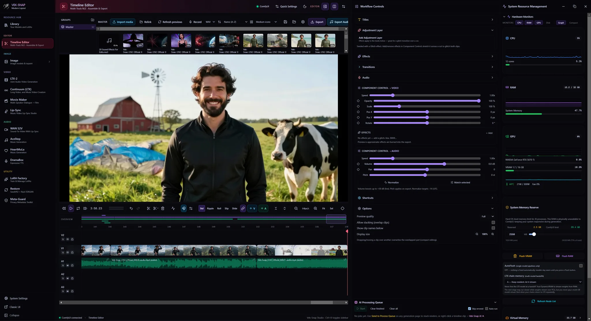
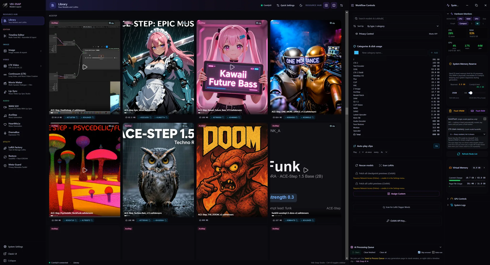
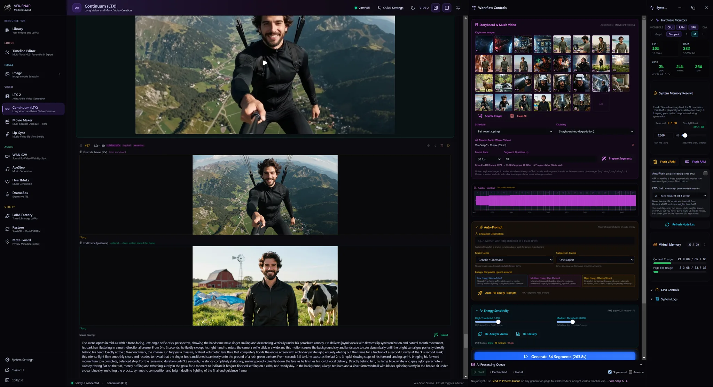
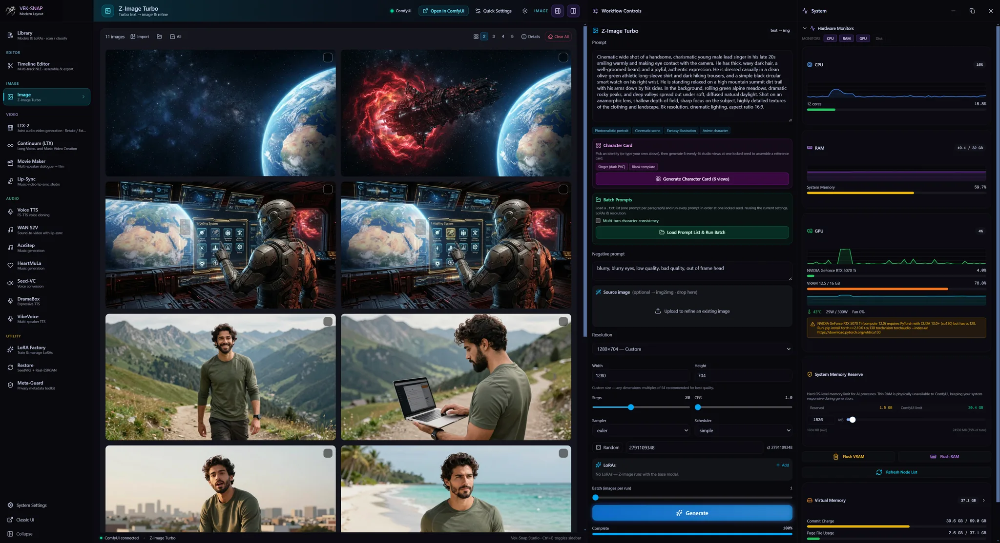

# Vek-Snap

A local, offline creative AI suite for Windows. Generate video, images, music,
voice, and restoration on your own PC. No accounts, no cloud, no telemetry.

> Made by Squishy Code AI LLC · <https://squishycode.ai>

Vek-Snap is source-available and free to run yourself. If you would rather skip
the setup, a one-click Guided Installer is available.

## Why Vek-Snap
- Runs entirely offline on your machine. You can verify it: the source is here.
- One suite for video, image, music, sound effects, narration, voice, and restoration.
- Respects your hardware: optional controls for memory reserve, virtual memory,
  GPU power limit, and a safety watchdog.
- No lock-in: import and export ComfyUI workflows and run community workflows offline.

> **Looking for something specific?** Vek-Snap spans 20+ creative studios plus a full
> timeline editor. Browse or search the complete, up-to-date feature list at
> <https://squishycode.ai>.

## Two ways to use it
1. **Free, from source.** Clone this repo, bring your own ComfyUI and models, and set up
   the stack yourself. It costs nothing but your time. This path is **unsupported** and
   provisions none of the backend for you. Community / self-built copies are **not**
   license-gated.
2. **Guided Installer.** Verifies your setup, fetches the right models, and configures
   everything in one pass, and it is code-signed so Windows trusts it out of the box. A single
   purchase activates up to 5 devices; after a one-time online activation the app runs
   100% offline. Available at <https://squishycode.ai>.

## Requirements
Vek-Snap scales to your hardware. The Guided Installer scans your PC and tells you
honestly what will run well before you commit.

### Minimum (gets you creating)
- Windows 10 or 11, 64-bit
- NVIDIA GPU with 8 GB VRAM
- 4 CPU cores
- 8 GB RAM (RAM only ever warns, it never blocks the install)
- 60 GB free disk (an SSD is advised)

At this tier you can generate images, restore and upscale, and work with audio and voice,
all fully offline. Full video generation and the largest models are the heavy lifts, so
expect those to be limited or impractical on a minimum setup.

### Recommended (every feature, comfortably)
- Windows 11, 64-bit
- NVIDIA RTX GPU with 16 GB or more VRAM
- 8 or more CPU cores
- 32 GB or more RAM
- 200 GB or more free on a fast NVMe SSD

16 GB of VRAM is the sweet spot for the whole suite, including video with synced audio.
The largest video models are happiest with 24 GB.

### A note from the developer
Most of Vek-Snap was built and tested on an aging NVIDIA GTX 1080 Ti from 2017 (nearly a
decade old), and the main development machine today has just 16 GB of VRAM. You do not need
cutting-edge hardware to do real work here. If your NVIDIA card has 8 GB or more, going back
to the GTX 10 series, you can create a lot, fully offline.

## Architecture
- **Desktop shell** (`shell/`): a thin Electron wrapper that opens the UI in a frameless
  window and manages the app lifecycle.
- **UI + orchestration** (`src/`): a Next.js app that renders every studio and exposes
  local API routes. `launcher.mjs` starts only this UI.
- **Backends:** ComfyUI (and any companion services) run as separate local processes,
  started **on demand** from the in-app Service Manager. The launcher detects your conda
  environments so services spawn with the right paths.
- **Privacy posture.** Offline and local-only by default: no analytics, no telemetry, no
  phone-home. Outbound network is **gated**: egress is blocked (a proxy dead-end plus offline
  model-downloader flags) until you explicitly enable Online mode, and then only for actions you
  initiate (model downloads, component/FFmpeg fetches, an optional update check). Both the UI and
  the ComfyUI backend bind to `127.0.0.1` only, Next.js telemetry is disabled, and the local API
  is authenticated (per-launch HMAC + Host/Origin checks).

## Security & privacy
- **Offline by default.** Vek-Snap performs no telemetry and attempts no outbound connection until
  you explicitly enable Online mode. The offline gate is a hard egress kill (a proxy dead-end plus
  Hugging Face / Transformers offline flags), so even an unaudited dependency's socket has nowhere
  to go.
- **User-consented network only.** When you open the gate, connections are limited to actions you
  start (model downloads, component/FFmpeg fetches, package installs, and an optional update check)
  and go directly from your machine to the provider. Nothing is proxied through us, and no
  prompts, files, or usage data are ever attached.
- **Loopback-only.** Both the Next.js UI and the ComfyUI backend bind to `127.0.0.1`; nothing is
  exposed to your LAN.
- **Hardened local API.** State-changing requests are signed with a per-launch HMAC and checked
  against a loopback Host/Origin allowlist, defeating CSRF and DNS-rebinding against the local
  server. ComfyUI's CORS is locked to the app's origin (never `*`).
- **Input hardening.** File-serving routes reject path traversal and non-media types, and
  subprocess calls use argv arrays (no shell), so crafted file or dataset names can't inject
  commands.
- **Everything in one place.** Models, caches, tokenizers, and settings live under the install
  directory (or your chosen models root), not scattered across `AppData` or `~/.cache`. Built-in
  "Clear Data" and an optional scrub-on-exit control let you wipe working files, and MetaGuard can
  strip identifying metadata from media you export.

## Install from source
Prerequisites:
- [Node.js](https://nodejs.org) 20 or newer and npm, Python 3.13, and [Git](https://git-scm.com)
- An NVIDIA driver current enough for your GPU (Vek-Snap uses a bundled CUDA runtime, so no system CUDA toolkit is required)
- Your own working **ComfyUI** install and the models you intend to use. On this path Vek-Snap
  orchestrates ComfyUI but does **not** download models or set up Python for you
- FFmpeg available on your PATH. The Guided Installer bundles a static FFmpeg build for you; on the from-source path you provide your own, otherwise the audio and video features that call FFmpeg will fail

Steps:

```powershell
# 1. Clone the repository and install dependencies
git clone https://github.com/Vek-Snap/veksnap-app.git
cd veksnap-app
npm install

# 2. Run it. Community / self-built copies are NOT license-gated, so both are free:
npm run launch:prod   # builds, then runs the optimized production build
#   or, for development with hot-reload:
npm run launch        # UI + on-demand services  (or `npm run dev` for the UI only)
```

The UI opens on a local `127.0.0.1` address (the launcher prints it). Start ComfyUI and any
other services from the **Service Manager** panel inside the app.

> **Note.** The one-time activation step exists only in the official signed release from
> <https://squishycode.ai>. Builds from this source run without it, and that's intentional, so you
> can audit the code and use Vek-Snap freely for personal, noncommercial purposes.

The Guided Installer automates all of the above (dependency setup, model downloads, and
configuration). Use it if you would rather not assemble the stack by hand.

### Packaging (optional)
`npm run package` bundles the launcher into a standalone `../VekSnap.exe` via `pkg`. This
produces an **unsigned** binary. Only official releases from <https://squishycode.ai> are
code-signed.

## Screenshots


Timeline editor: assemble clips, sync audio, and export finished video, all offline.



Resource hub: your organized library of models and renders, with in-app video playback and presentation controls.



LTX Continuum: continuous long-form video generation with scene-to-scene continuity.



Image generation and management: batch prompts, live previews, and per-image metadata with quick actions.

## License
Vek-Snap is licensed under the PolyForm Noncommercial License 1.0.0. You may use,
modify, and share it for noncommercial purposes. See [`LICENSE`](./LICENSE). Commercial use
requires a separate license. Third-party components and their licenses are listed
in [`NOTICE.md`](./NOTICE.md).

## Content and safety
Vek-Snap is an offline creative tool intended for lawful, consensual content and for users
18 and older; prohibited uses are described in [`EULA.md`](./EULA.md). Because it is fully
offline, the app never receives, stores, or transmits your content.

## Support
- Website: <https://squishycode.ai>
- Contact: <contact@squishycode.ai>
